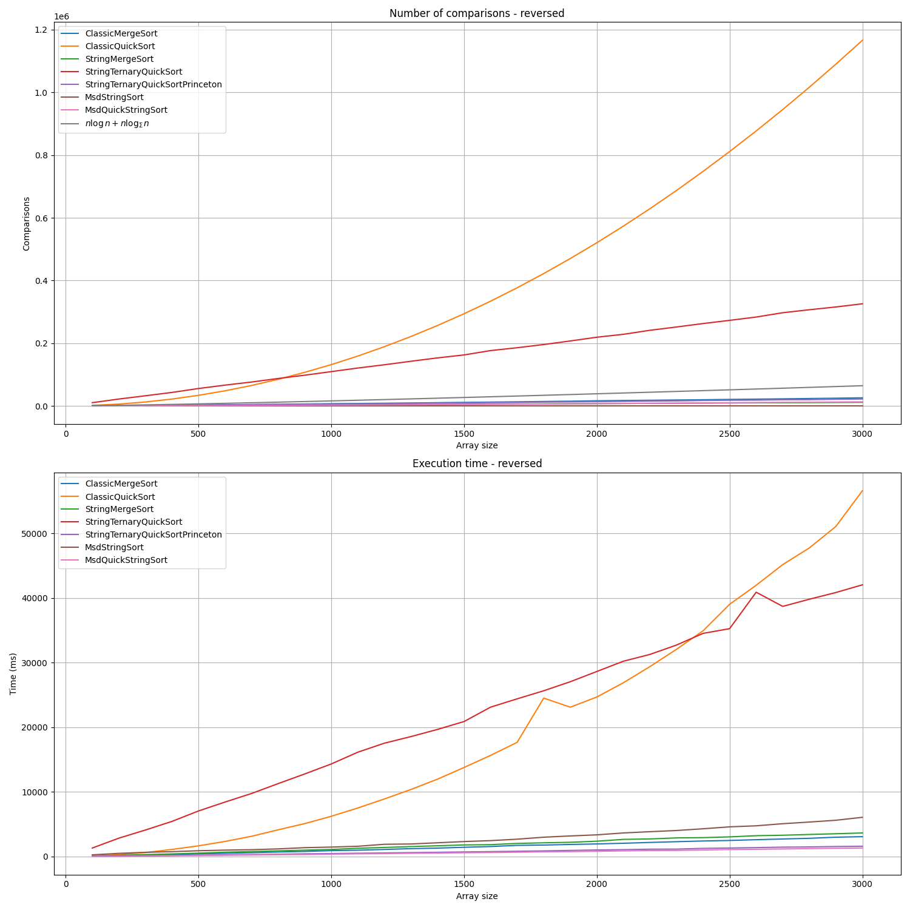
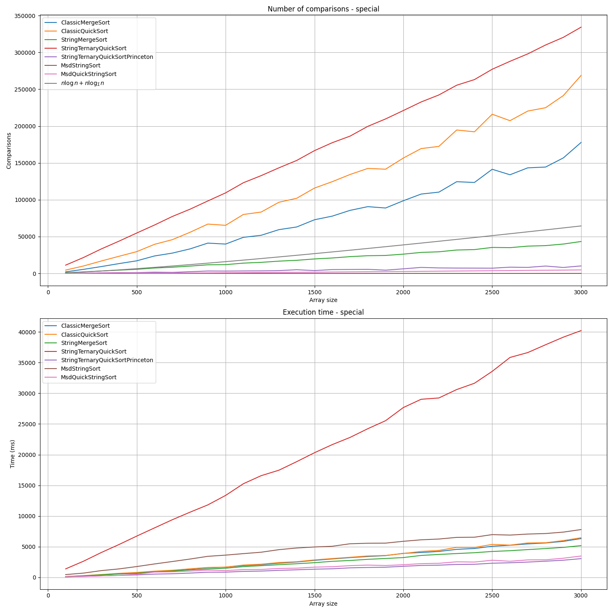
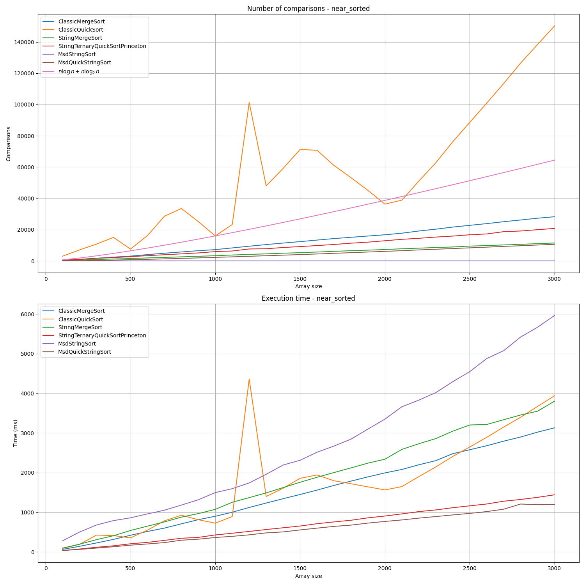
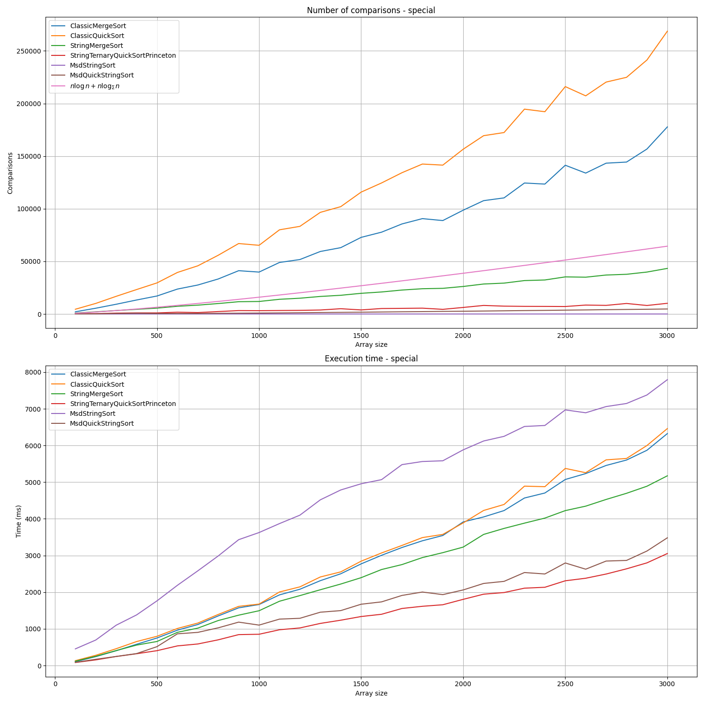

# Задача A1. Анализ строковых сортировок
## Выполнил студент 2 курса, Асланян Давид

## Краткая сводка:
1. Реализации классов StringGenerator и StringSortTester представлены в директории `/testing`.

2. ID посылок по задачам A1m, A1q, A1r и A1rq в системе CodeForces с реализациями адаптированных алгоритмов сортировки строк:
    - [A1m - String Merge Sort](https://dsahse.contest.codeforces.com/group/NOflOR1Qt0/contest/608956/submission/320153044)

    - [A1q - String Quick Sort](https://dsahse.contest.codeforces.com/group/NOflOR1Qt0/contest/608956/submission/320145771)

    - [A1r - MSD Radix Sort](https://dsahse.contest.codeforces.com/group/NOflOR1Qt0/contest/608956/submission/320149827)

    - [A1rq - MSD Radix+Quick Sort](https://dsahse.contest.codeforces.com/group/NOflOR1Qt0/contest/608956/submission/320150290)

    2 реализация (проектная)

    - [A1m - String Merge Sort](https://dsahse.contest.codeforces.com/group/NOflOR1Qt0/contest/608956/submission/320832565)

    - [A1q - String Quick Sort](https://dsahse.contest.codeforces.com/group/NOflOR1Qt0/contest/608956/submission/320832722)

    - [A1r - MSD Radix Sort](https://dsahse.contest.codeforces.com/group/NOflOR1Qt0/contest/608956/submission/320832971)

    - [A1rq - MSD Radix+Quick Sort](https://dsahse.contest.codeforces.com/group/NOflOR1Qt0/contest/608956/submission/320833052)

3. Инструкция по запуску
### Быстрый способ
   Можно запустить `bash`-скрипт `make_all.sh` в корне проекта.
### Если не получается запустить скрипт/скрипт выполняется с ошибками
   - чтобы запустить проект нужно зайти в папку `/build` и дальше в VS Code нажать на кнопку **Сборка**, после билда нажать на **кнопку запуска** по результату в папке `/results` по папкам типов генераций списков строк `near_sorted`, `random`, `reversed`, `special` будут разложены результаты

   - чтобы запустить python-скрипт - нужно перейти в корневую директорию проекта и написать в терминале команды: 

      - создания venv `python3 -m venv venv`
      - активация venv `source venv/bin/activate`
      - установка пакета matplotlib для отрисовки графиков `pip install -r requirements.txt` - результаты графиков окажутся в папке `plots`
      - для запуска скрипта надо написать команду `python3 plots.py`

---

## Анализ результатов

StringTernaryQuickSort при реализации по псевдокоду получалась хуже всех(даже хуже классических сортировок), что вызывало подозрения, поскольку эту сортировку хвалили на лекциях, и не только на [них](https://www.drdobbs.com/database/sorting-strings-with-three-way-radix-qui/184410724), к сожалению на странице не было бенчмарков, а ссылки на них были битые. Такая долгая работа обычной реализации связана с тем, что решить задачу National Dutch Flag Problem эффективно довольно сложно. После долгих часов гугла удалось найти [эффективный вариант, на Java в лекциях Принстона](https://www.cs.princeton.edu/courses/archive/fall04/cos226/lectures/radix.4up.pdf). Далее на графиках в легенде `StringTernaryQuickSortPrinceton`. Поскольку обычный вариант `StringTernaryQuickSort` сильно плох, что мешает анализировать другие сортировки(почти все графики сильно внизу), то на графиках сравнения с другими сортировками будем сравнивать именно `StringTernaryQuickSortPrinceton`. Также на графиках для сравнений добавим прямую $n\log{n}+n\log_{\Sigma}{n}$ (теоретическую нижнюю границу числа сравнений, необходимых для сортировок строк). Также приведем графики с обычным вариантом `StringTernaryQuickSort`.

 

### 1. Random (полностью случайные данные)  

- **Сравнения**:  
   - На случайных данных лучше всего показывается по числу сравнений **Msd String Sort**, на графиках он везде внизу, потому, что эта сортировка не выполняет никаких сравнений, она использует устойчивую сортировку подсчетом(так будет на всех графиках сравнений).
   - На втором месте, ожидаемо `MsdQuickStringSort`, поскольку сравнения используются для сортировки только малых групп.
   - Далее идут `StringTernaryQuickSortPrinceton` и `StringMergeSort`
   - И, ожидаемо, хуже всего себя показали классические сортировки, которые никак не используют тот факт, что сортируются строки.
- **Время (скорость)**: 
   - На случайных данных, крайне неожиданно, проиграл MSDStringSort, однако можно заметить что выиграл также алгоритм, в основе использующий MSD, но с оптимизацией в виде вызова `StringTernaryQuickSortPrinceton`. Это можно объяснить тем, что MSD крайне эффективен на первых шагах рекурсии, однако при сортировке малых групп, выполняет множество безполезных рекурсивных вызовов, что сильно ухудшает работу алгоритма. Наверное, по этой причине в качестве порога для запуска `StringTernaryQuickSortPrinceton` было предложено использовать мощность алфавита.
   - Не сильно уступает использование `StringTernaryQuickSortPrinceton` перед `MsdQuickStringSort`(с оптимизацией). Это связано с тем, что Msd разбивает большой массив на группы довольно эффективно, а Three-Way-Partition бъет всего на три группы, для двух из которых мы даже не увеличиваем глубину рекурсии.
   - `StringMergeSort` оказался вверху вместе с `MsdStringSort`, не смотря на то, что он использует меньше сравнений, чем классический. Скорее всего это связано с оверхедом на поддержку всех необходимых алгоритму структур.
   - Классические сортировки работают(вполне ожидаемо) хуже, чем специализированные.

### 2. Reversed (обратно отсортированные данные)

Без Classic Quick Sort

Тут все довольно интересно:
- QuickSort показывет сильно плохие результаты, это не удивительно так как оба алгоритма используют одну и ту же стратегию выбора опорного элемента. Стратегия выбора - медиана трех. Если брать первый элемент, то StringTester на долго зависает, так что медиана трех хоть и решает проблему, но все еще не делает сортировку лучшей. В данном случае так много сравнений происходит в силу того, что обратно отсортированный массив содержит максимально возможное число транспозиций, а быстрая сортировка основана на сравнениях.
- При этом StringTernaryQuickSortPrinceton себя тоже показал не очень хорошо, в сравнении даже с классическим MergeSort.
- Все еще лидером остался Msd с оптимизацией.
- Также примечательно, что StringQuickSort отработал лучше классического, это можно объяснить тем что в отсортированном массиве элементы с большим lcp находятся рядом. Также это подтверждает график числа сравнений.

### 3. Near_sorted (почти отсортированные данные)

- Лидер по времени - MSD с оптимизацией через тернарный QuickSort

### 4. Special (специально сгенерированные префиксные данные) 
 
- Лидер по времени - тернарный String Quick Sort.
- Тут оптимизация MSD проиграла по времени тернарному алгоритму, это можно объяснить тем, что MSD долго бесцельно остается а одинаковых группах(с большим lcp), ничего не разбивая. Это также подтверждает сильно медленно работающий MSD без оптимизаций. Но все еще этот алгоритм остается в лидерах.
- Довольно неплохо работает также StringQuickSort, поскольку он опирается на сравнение через lcp, а в тестовом наборе много данных с общими префиксами.
- Классические сортировки как обычно не в лидерах.
---

Также можно заметить, что графики многих сортировок оказались ниже теоретической границы, это связано с тем что оценка нижней границы числа сравнений делается в предположении что нужно гарантированно отсортировать произвольный массив. На практике же часто нужно сделать меньше сравнений, так как многие сортировки понимают, когда нужно остановиться и более ничего не делать.

**Вывод:**  
- На практике почти везде выигрывает гибридный алгоритм из MSDQuickSort и тернарного QuickSort, поскольку использует сильеые стороны двух этих алгоритмов.  
- Также хорошо себя показывает тернарный StringQuickSort в чистом виде.  
- В случае специальных данных либо когда близко находятся данные с большими общими преффиксами хорошо себя показывает StringMergeSort, однако все равно выигрывает гибрид MSDQuickSort. Часто он немного проигрывает классическому, из-за оверхеда на поддержку структур с lcp.
- Классические сортировки работают хуже специальных, что хорошо сограсуется с теорией.
- Также ситуация с тернарным StringQuickSort показывает, что на практике важна не только хорошая асимптотическая сложность, но и возможность реализовать алгоритм с минимальной константой времени выполнения, также на практике часто влияет на скорость работы порядок обработки данных: данные, находящиеся в памяти близко обычно обрабатываются быстрее, в силу эффективного использования кешей процессора(доступ из кешей нижнего уровня в разы быстрее чем доступ к оперативной памяти). Вариант, который предлагается в реализации с презентаций Принстона, более кеш-локален, чем классический ThreeWayPartition. Также в этом варианте скорее всего лучше работает [branch prediction](https://ru.wikipedia.org/wiki/Предсказатель_переходов), поскольку в циклах меньше странного ветвления. Довольно интересным экспериментом было бы попробовать подружить эту эффективную реализацию с реализацией [BlockQuickSort](https://arxiv.org/pdf/1604.06697), предполагаю что так может стать еще быстрее.

